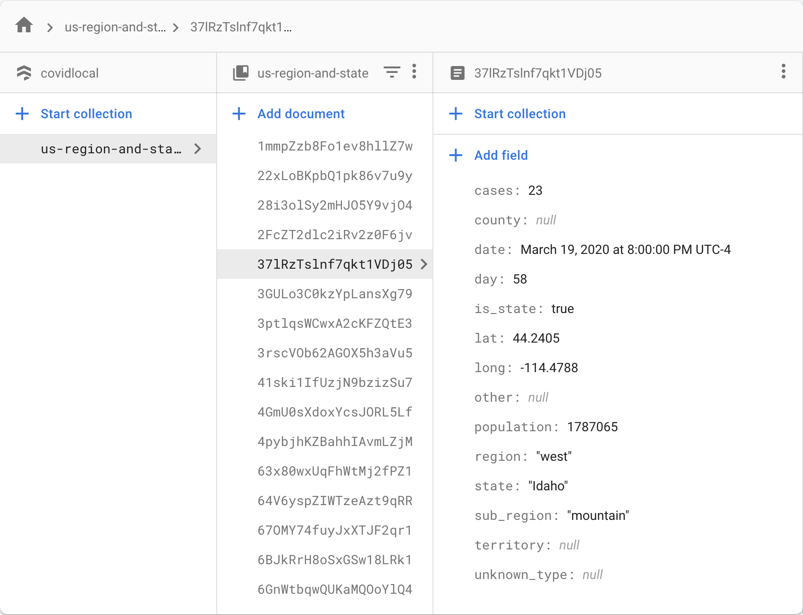

# covid-19-growth

The Johns Hopkins University Center for Systems Science and Engineering is providing
[daily COVID-19 CSV files](https://github.com/CSSEGISandData/COVID-19) containing the data that are
displayed on their
[ArcGIS dashboard for COVID-19](https://gisanddata.maps.arcgis.com/apps/opsdashboard/index.html#/bda7594740fd40299423467b48e9ecf6).
This repo provides:
- A sensible starting point and some useful functions for COVID-19 reporting/analysis/modeling using
  Pandas/Python
- Parsed CSV and JSON data structures for use outside of Pandas
- Google Firebase integration


 ```
>>> print(df_us_region_and_state['cases'])

            date   region          sub_region       state  population  cases
0    2020-01-22  midwest  east_north_central    Illinois  12671821.0      0
1    2020-01-22  midwest  east_north_central     Indiana   6732219.0      0
2    2020-01-22  midwest  east_north_central    Michigan   9986857.0      0
3    2020-01-22  midwest  east_north_central        Ohio  11689100.0      0
4    2020-01-22  midwest  east_north_central   Wisconsin   5822434.0      0
...         ...      ...                 ...         ...         ...    ...
2845 2020-03-18     west             pacific      Alaska    731545.0      6
2846 2020-03-18     west             pacific  California  39512223.0    751
2847 2020-03-18     west             pacific      Hawaii   1415872.0     14
2848 2020-03-18     west             pacific      Oregon   4217737.0     68
2849 2020-03-18     west             pacific  Washington   7614893.0   1014

[2850 rows x 6 columns]
>>>  
```

For VSCode users, available as a self-contained, system-independent environment using Docker Remote with Jupyter Notebook integration.


## Installing
### Vanilla
Clone and set up your Python environmet. For Virtualenv, just copy/paste:
```
git clone https://github.com/willhaslett/covid-19-growth.git
cd covid-19-growth
virtualenv venv
source venv/bin/activate
pip install -q -r requirements.txt

```
Verify installation
```
$ python lib/tests.py
Updated pickle file df_all.p with global data
Updated pickle file df_us.p
Updated pickle file df_us_region_and_state.p
Updated CSV files
Updated JSON files
Tests passed
$
```

### VSCode/Docker
Have the [VSCode extension for Remote Development](https://marketplace.visualstudio.com/items?itemName=ms-vscode-remote.vscode-remote-extensionpack) installed. Here 'remote' means in a local Docker container (Debian).

In VSCode, [Open the project folder in a container](https://code.visualstudio.com/docs/remote/containers#_quick-start-open-an-existing-folder-in-a-container)

Verify the installation as above.

## Usage

### `dump_csv_and_json.py`
Creates CSV and JSON files for the nine Pandas dataframes. Data are synchronized with the Johns Hopkins repo at runtime.

* **CSV**
  Comma-delimited files for each dataframe. The formats mirror the dataframes as described below.

* **JSON**
  JavaScript Object Notation files for each dataframe. Files are constructed using the `orient='table'` argument for 
  [pandas.DataFrame.to_json](https://pandas.pydata.org/pandas-docs/stable/reference/api/pandas.DataFrame.to_json.html).
  Choose a different structure for the JSON files by setting `JSON_ORIENT`. For minified JSON, set `JSON_INDENT` to 0.

### `c19all.py`
* **`df_all`** A dictionary containing dataframes with all global data for cases, deaths, and recoveries. `province_state` has mixed types, as it does upstream.
  ```
  print(df_all['cases'])

              date  day  cases  province_state              country      lat      long
  0     2020-01-22    0      2             NaN             Thailand  15.0000  101.0000
  1     2020-01-22    0      2             NaN                Japan  36.0000  138.0000
  2     2020-01-22    0      0             NaN            Singapore   1.2833  103.8333
  3     2020-01-22    0      0             NaN                Nepal  28.1667   84.2500
  4     2020-01-22    0      0             NaN             Malaysia   2.5000  112.5000
  ...          ...  ...    ...             ...                  ...      ...       ...
  21887 2020-03-13   51      2             NaN                Aruba  12.5211  -69.9683
  21888 2020-03-13   51      2  Grand Princess               Canada  37.6489 -122.6655
  21889 2020-03-13   51      1             NaN                Kenya  -0.0236   37.9062
  21890 2020-03-13   51      1             NaN  Antigua and Barbuda  17.0608  -61.7964
  21891 2020-03-13   51      5         Alabama                   US  32.3182  -86.9023
  
  [21892 rows x 7 columns] 
  ```

* **Functions**
  - `filter(df, column, vlaue)` Generic filter
  - `for_country(df, country)` Filter by country
  - `for_province_state(df, province_state)` Filter by province_state
  - `sum_by_date(df)` Group by date and sum case counts 

### `c19us.py`
* **`df_us`** A dictionary with dataframes for US cases, deaths, and recoveries. Mixed location data
from upstream are parsed into idividual columns for different location types. For state-level data,
sub_region, region, and population are added.
  ```
              date  day  cases          state     county       territory             other is_state      lat      long          sub_region     region  population
  0     2020-01-22    0      0     Washington       None            None              None     True  47.4009 -121.4905             pacific       west   7614893.0
  1     2020-01-22    0      0       New York       None            None              None     True  42.1657  -74.9481        mid_atlantic  northeast  19453561.0
  2     2020-01-22    0      0     California       None            None              None     True  36.1162 -119.6816             pacific       west  39512223.0
  3     2020-01-22    0      0  Massachusetts       None            None              None     True  42.2302  -71.5301         new_england  northeast   6892503.0
  4     2020-01-22    0      0           None       None            None  Diamond Princess    False  35.4437  139.6380                 NaN        NaN         NaN
  ...          ...  ...    ...            ...        ...             ...               ...      ...      ...       ...                 ...        ...         ...
  13333 2020-03-15   53      0       Delaware  NewCastle            None              None    False  39.5393  -75.6674                 NaN        NaN         NaN
  13334 2020-03-15   53     12        Alabama       None            None              None     True  32.3182  -86.9023  east_south_central      south   4903185.0
  13335 2020-03-15   53      3           None       None     Puerto Rico              None    False  18.2208  -66.5901                 NaN        NaN         NaN
  13336 2020-03-15   53      1           None       None  Virgin Islands              None    False  18.3358  -64.8963                 NaN        NaN         NaN
  13337 2020-03-15   53      3           None       None            Guam              None    False  13.4443  144.7937                 NaN        NaN         NaN

  [13338 rows x 13 columns]
  ```
  Be wary of the county-level US data. The makeup of the US data between counties and states has been, understandably, inconsistent over time. `df_us_region_and_state` aggregates both county and state-level records.

  
  

* **`df_us_region_and_state`** A dictionary of US data by date, aggregated at the state level, with columns for sub_region, region, and population.
  ```
  >>> print(df_us_region_and_state['cases'])

             date   region          sub_region       state  population  cases
  0    2020-01-22  midwest  east_north_central    Illinois  12671821.0      0
  1    2020-01-22  midwest  east_north_central     Indiana   6732219.0      0
  2    2020-01-22  midwest  east_north_central    Michigan   9986857.0      0
  3    2020-01-22  midwest  east_north_central        Ohio  11689100.0      0
  4    2020-01-22  midwest  east_north_central   Wisconsin   5822434.0      0
  ...         ...      ...                 ...         ...         ...    ...
  2845 2020-03-18     west             pacific      Alaska    731545.0      6
  2846 2020-03-18     west             pacific  California  39512223.0    751
  2847 2020-03-18     west             pacific      Hawaii   1415872.0     14
  2848 2020-03-18     west             pacific      Oregon   4217737.0     68
  2849 2020-03-18     west             pacific  Washington   7614893.0   1014

  [2850 rows x 6 columns]
  >>>
  ```

* **Pickle files**

  `df_us.p` and `df_us_region_and_state.p` are pickle files that persist the corresponding dictionaries of dataframes. For performance reasons, it is recommended to use these pickles for downstream work with the US data rather than importing the `c19us.py` module.

* **Jupyter Notebooks**
  
  `all.ipynb` and `us.ipynb` contain starting points for work with global or US data. You can preview the notebook stubs here in GitHub by navigating to them:
  
  [Global Cases](https://github.com/willhaslett/covid-19-growth/blob/master/notebooks/all.ipynb)
  
  [US Deaths](https://github.com/willhaslett/covid-19-growth/blob/master/notebooks/us.ipynb)

## Firebase
- [Create your Firebase project](https://firebase.google.com/) and add a Firestore database
- Create and download a private key JSON file for your project (Project settings > Service accounts)
- Rename the downladed file to `.google_service_account_key.json` and put it in the project root (this file is ignored by Git) 
- Customize `lib/upload_to_firestore.py` so that it works with the specific data that you want to upload
- `python lib/upload_to_firestore.py`
- Coffee

  

## Feature Suggestions

  If there is a new feature that would help to streamline your work with these data, please create a feature request issue.

## License

This project is licensed under the MIT License. See the [LICENSE.md](LICENSE.md) file for details

## Acknowledgments

The Johns Hopkins University Center for Systems Science and Engineering is doing a great public service by sharing these data.
