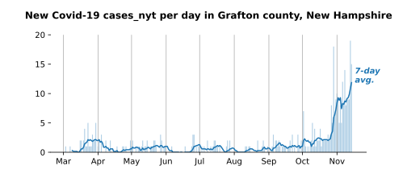
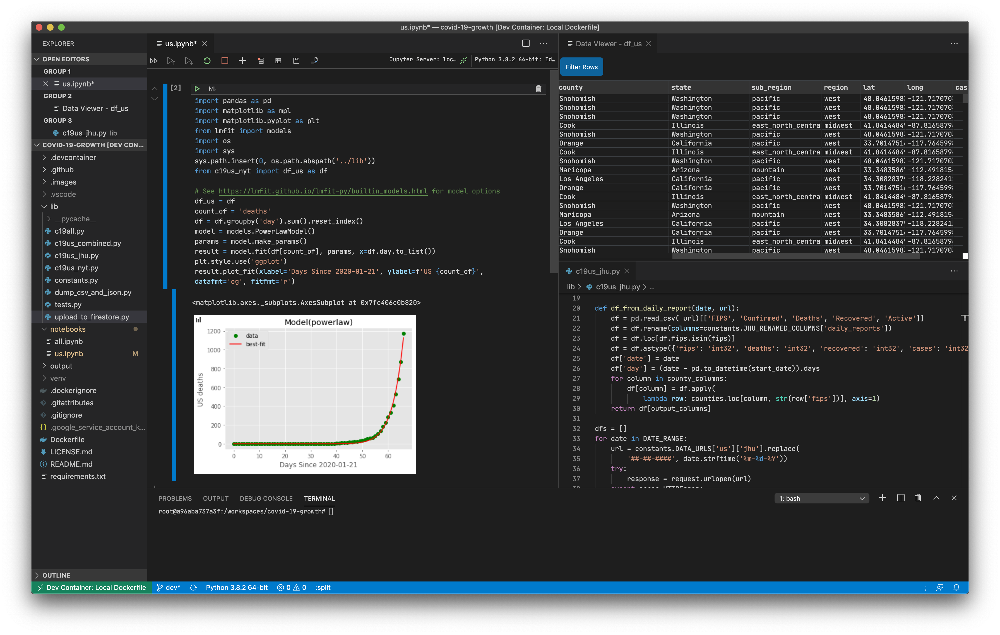
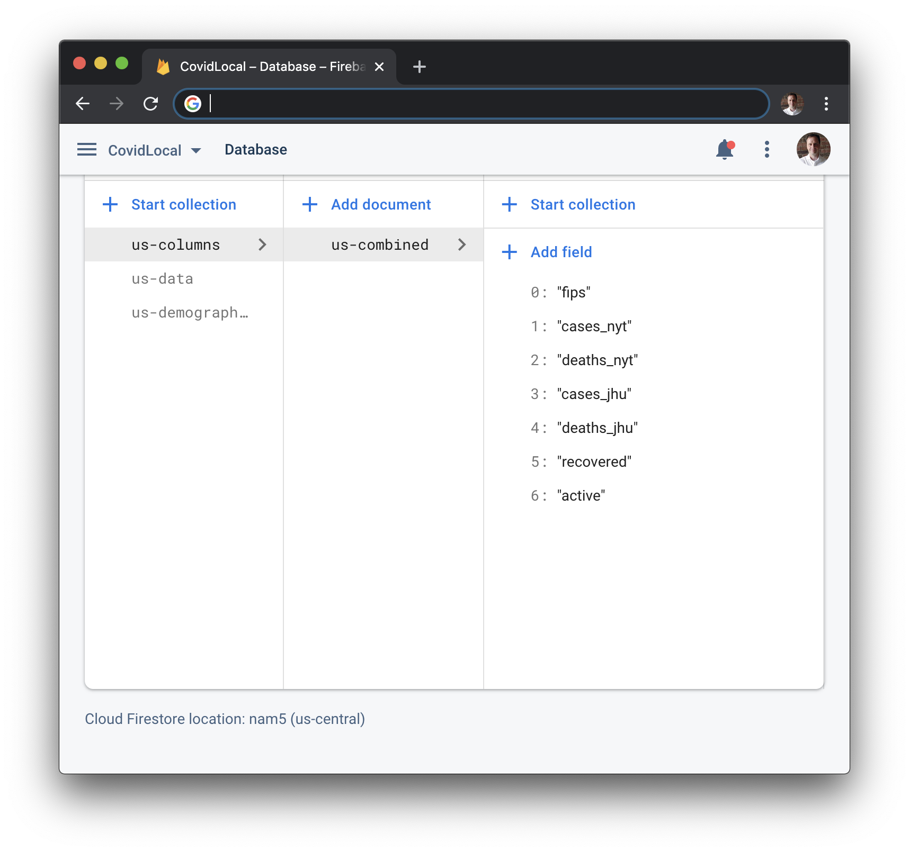
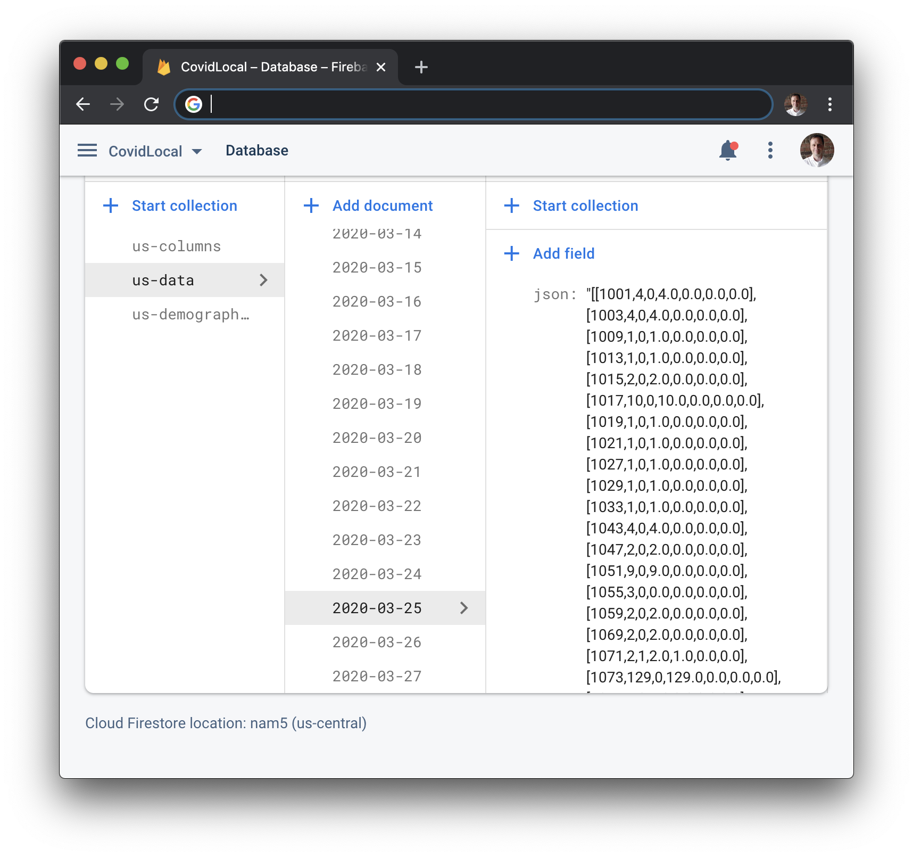
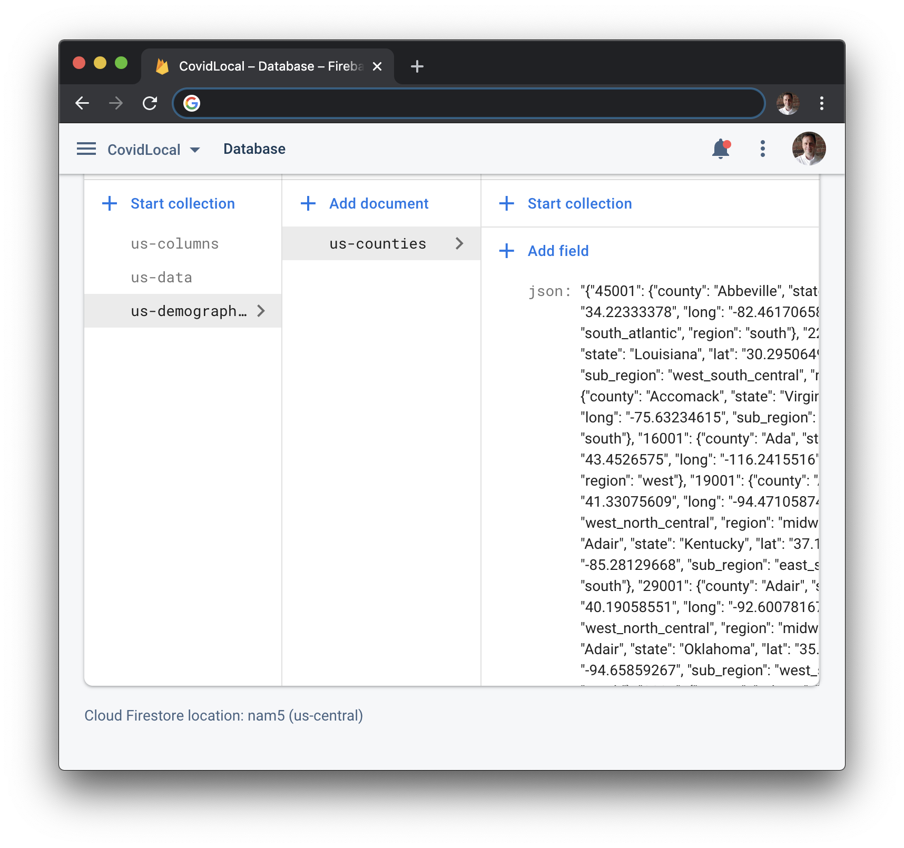

# covid-19-growth

The [New York Times](https://github.com/nytimes/covid-19-data)
and the [Johns Hopkins University Center for Systems Science and Engineering](https://github.com/CSSEGISandData/COVID-19)
are providing daily Covid-19 case
count files. This pipeline:
- Imports the NYT and JHU data
- Performs type conversions where needed
- Adds demographic data
- Outputs the resulting data structures as a set of long-format time series
- Jupyter Notebook stubs in place, including US county-level case rate trends



The latest NYT and JHU files are pulled from GitHub at runtime. All data operations are vectorized. All data from 2020-01-21 to the present are imported whenever you generate new CSV, JSON, or Pickle files. This assures that all revisions to JHU or NYT raw files will be included here. 


  - [Installing](#installing)
    - [Virtualenv](#virtualenv)
    - [VSCode](#vscode)
  - [Usage](#usage)
    - [What do I get?](#what-do-i-get)
    - [CSV, JSON, and Pickle files for the transformed data](#csv-and-json)
    - [Global Data](#global-data)
    - [US Data](#us-data)
  - [Jupyter Notebooks](#jupyter-notebooks)
  - [Firebase](#firebase)
  - [License](#license)
  - [Acknowledgments](#acknowledgments)


## Installing
### Virtualenv
Copy/paste
```
git clone https://github.com/willhaslett/covid-19-growth.git
cd covid-19-growth
virtualenv venv
source venv/bin/activate
pip install -q -r requirements.txt

```
Verify installation
```
$ python lib/update.py
Updated pickle file df_all.p with global data
Updated pickle file df_us_jhu.p with Johns Hopkins data
Updated pickle file df_us_nyt.p with New York Times data
Updated pickle file df_us_combined.p with Johns Hopkins and New York Times data
Updated CSV files
Updated JSON files
Output Pickle, CSV and JSON files are up-to-date. For further work in Pyhon, import the Pickles!
$
```

### VSCode
-  Have the [VSCode extension for Remote Development](https://marketplace.visualstudio.com/items?itemName=ms-vscode-remote.vscode-remote-extensionpack) installed. Here 'remote' means in a local Docker container (Debian).
- In VSCode, [Open the project folder in a container](https://code.visualstudio.com/docs/remote/containers#_quick-start-open-an-existing-folder-in-a-container)
- Verify the installation as above.




## Usage

### What do I get?
Two sets of output data are constructed at runtime, one for all global data and one for all US data.
The US data are parsed and demographic data are added.
The NYT and JHU US data are available separately and as a combined time series.

The three output formats, Pandas, CSV and JSON, all contain the same data, with the dataframes and CSV files
having the same tabular format, and the JSON files structured by the
[pandas.DataFrame.to_json](https://pandas.pydata.org/pandas-docs/stable/reference/api/pandas.DataFrame.to_json.html) function.

- Global data (JHU)
  - df_all_cases
  - df_all_deaths 
- US data
  - df_us_jhu
  - df_us_nyt
  - df_us_combined

### Global Data
`c19all.py`
* **`df_all`** A dictionary containing dataframes with all global data for cases, deaths, and recoveries. `province_state` has mixed types, as it does upstream.
  ```
  print(df_all['cases'])

              date  day  cases         province_state                country        lat        long
  0     2020-01-22    0      0                    NaN            Afghanistan  33.000000   65.000000
  1     2020-01-22    0      0                    NaN                Albania  41.153300   20.168300
  2     2020-01-22    0      0                    NaN                Algeria  28.033900    1.659600
  3     2020-01-22    0      0                    NaN                Andorra  42.506300    1.521800
  4     2020-01-22    0      0                    NaN                 Angola -11.202700   17.873900
  ...          ...  ...    ...                    ...                    ...        ...         ...
  16429 2020-03-27   65      2                    NaN  Saint Kitts and Nevis  17.357822  -62.782998
  16430 2020-03-27   65      1  Northwest Territories                 Canada  64.825500 -124.845700
  16431 2020-03-27   65      3                  Yukon                 Canada  64.282300 -135.000000
  16432 2020-03-27   65     86                    NaN                 Kosovo  42.602636   20.902977
  16433 2020-03-27   65      8                    NaN                  Burma  21.916200   95.956000

  [16434 rows x 7 columns]
  ```

* **Functions**
  - `filter(df, column, vlaue)` Generic filter
  - `for_country(df, country)` Filter by country
  - `for_province_state(df, province_state)` Filter by province_state
  - `sum_by_date(df)` Group by date and sum case counts 

### US Data
The three output US data structures all have the same basic shape.
Note however that whereas the NYT time series starts on 2020-01-21, the JHU time series
starts on 2020-03-22, the date when JHU changed the format of their US data.
`date` and `fips` are used as a multindex in Pandas, and these are added as columns
in the CSV and JSON files.

`c19us_jhu.df_us` and `c19us_nyt.df_us` are combined in `c19us_combined` as shown below.
Here, the suffixes `_nyt`and `_jhu` are added to the case and death data.
```
>>> from c19us_combined import df_us
>>> print(df_us)    
                   day      county       state          sub_region   region          lat          long  cases_nyt  deaths_nyt  cases_jhu  deaths_jhu  recovered  active
date       fips                                                                                                                                                        
2020-01-21 53061     0   Snohomish  Washington             pacific     west  48.04615983  -121.7170703          1           0        NaN         NaN        NaN     NaN
2020-01-22 53061     1   Snohomish  Washington             pacific     west  48.04615983  -121.7170703          1           0        NaN         NaN        NaN     NaN
2020-01-23 53061     2   Snohomish  Washington             pacific     west  48.04615983  -121.7170703          1           0        NaN         NaN        NaN     NaN
2020-01-24 17031     3        Cook    Illinois  east_north_central  midwest  41.84144849  -87.81658794          1           0        NaN         NaN        NaN     NaN
           53061     3   Snohomish  Washington             pacific     west  48.04615983  -121.7170703          1           0        NaN         NaN        NaN     NaN
...                  .         ...         ...                 ...      ...          ...           ...        ...         ...        ...         ...        ...     ...
2020-03-26 56025    65     Natrona     Wyoming            mountain     west  42.96180148   -106.797885          6           0        6.0         0.0        0.0     0.0
           56029    65        Park     Wyoming            mountain     west  44.52157546  -109.5852825          1           0        1.0         0.0        0.0     0.0
           56033    65    Sheridan     Wyoming            mountain     west  44.79048913  -106.8862389          4           0        4.0         0.0        0.0     0.0
           56037    65  Sweetwater     Wyoming            mountain     west  41.65943896  -108.8827882          1           0        1.0         0.0        0.0     0.0
           56039    65       Teton     Wyoming            mountain     west  43.93522482  -110.5890801          8           0        7.0         0.0        0.0     0.0

[13832 rows x 13 columns]
>>>
```

## CSV and JSON
`dump_csv_and_json.py`
Creates CSV and JSON files for the five Pandas dataframes. Data are synchronized with the upstream repos at runtime.

- **CSV:**
  Comma-delimited files for each dataframe. The formats mirror the dataframes as described above.

- **JSON:**
  JavaScript Object Notation files for each dataframe. Files are constructed using the `orient='table'` argument for 
  [pandas.DataFrame.to_json](https://pandas.pydata.org/pandas-docs/stable/reference/api/pandas.DataFrame.to_json.html).
  Choose a different structure for the JSON files by setting `JSON_ORIENT` in `lib/dump_csv_and_json.py`. JSON files are minified by default. For not-minified JSON, set `JSON_INDENT` to > 0.

## Jupyter Notebooks
  
  `all.ipynb` and `us.ipynb` contain starting points for work with global or US data. You can preview the notebook stubs here in GitHub by navigating to them:

## Firebase
### Prerequisites
  - [Create your Firebase project](https://firebase.google.com/) and add a Firestore database.
  - Create and download a private key JSON file for your project. (Project settings > Service accounts)
  - Rename the downladed file to `.google_service_account_key.json` and put it in the project root. This file will be ignored by Git.

### Usage
`python lib/upload_to_firestore.py`

 Currently, this script uploads the combined US data structure to Firestore using the following scheme: 
  1. A schema document that defines the column names for the associated data documents
    
  1. A collection of data documents, split by date, with all data for a date stored in a single JSON string
    
  3. A document containing the available additional data for all counties in the dataset, keyed by fips code
    

## License

This project is licensed under the MIT License. See the [LICENSE.md](LICENSE.md) file for details

## Acknowledgments

The New York Times and the Johns Hopkins University Center for Systems Science and Engineering are doing a great public service by sharing these data.

