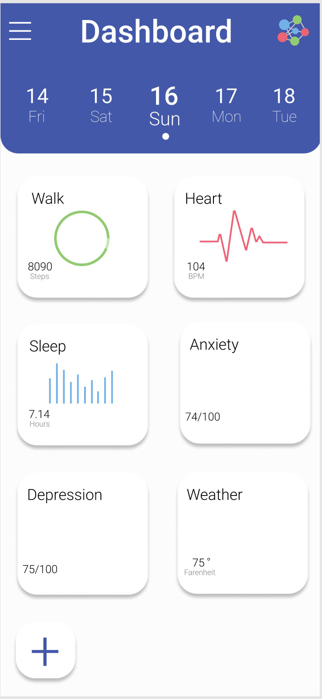

# covid-19-growth

The Johns Hopkins University Center for Systems Science and Engineering is providing
[daily COVID-19 CSV files](https://github.com/CSSEGISandData/COVID-19) containing the data that are
displayed on their
[ArcGIS dashboard for COVID-19](https://gisanddata.maps.arcgis.com/apps/opsdashboard/index.html#/bda7594740fd40299423467b48e9ecf6).
This repo aims to provide a sensible starting point and some useful functions for ongoing work in
Pandas/Python using the JH data.

`modeling_stub.ipynb` contains a template demonstrating the use of `lmfit` with these data.

No breaking changes to `c19all.py` or `c19us.py` are anticipated.

For VSCode users, available as a self-contained, system-independent environment using Docker Remote with Jupyter Notebook integration.



## Installing
### Vanilla

Clone the repo **with --recursive**
```
git clone --recursive git@github.com:willhaslett/covid-19-growth.git
```

Set up your Python environmet. For example, with virtualenv
```
cd covid-19-growth
virtualenv venv
source venv/bin/activate
pip install -r requirements.txt
```
Verify installation
```
$ python lib/tests.py

Cases (head):
  province_state    country      lat      long       date  cases  day
0            NaN   Thailand  15.0000  101.0000 2020-01-22      2  0.0
1            NaN      Japan  36.0000  138.0000 2020-01-22      2  0.0
2            NaN  Singapore   1.2833  103.8333 2020-01-22      0  0.0
3            NaN      Nepal  28.1667   84.2500 2020-01-22      0  0.0
4            NaN   Malaysia   2.5000  112.5000 2020-01-22      0  0.0

...

Tests passed
$
```

### VSCode/Docker

Clone the repo as above (--recursive!)

Have the [VSCode extension for Remote Development](https://marketplace.visualstudio.com/items?itemName=ms-vscode-remote.vscode-remote-extensionpack) installed. Here 'remote' means in a local Docker container (Debian).

In VSCode, [Open the project folder in a container](https://code.visualstudio.com/docs/remote/containers#_quick-start-open-an-existing-folder-in-a-container)

Verify the installation as above.

## Usage

The JH submodule is pulled nightly, updating the source data. To force a pull locally:
```
./update_data.sh
```

### Available in `c19all.py`
* Dataframes
  - `df_all` A dictionary containing dataframes with all global data for cases, deaths, and recoveries
  - `df_cases` All global cases. Deprecated. Use `df_all`. Will be removed 2020-03-15.
  - `df_deaths` All global deaths. Deprecated. Use `df_all`. Will be removed 2020-03-15.
  - `df_recovered` All global recoveries. Deprecated. Use `df_all`. Will be removed 2020-03-15.

* Functions
  - `filter(df, column, vlaue)` Generic filter
  - `for_country(df, country)` Filter by country
  - `for_province_state(df, province_state)` Filter by province_state
  - `sum_by_date(df)` Group by date and sum case counts 

### Available in `c19us.py`
* Dataframes
  - `df_us` A dictionary of case, death, and recovery dataframes for the US. Best to use one of the following dataframes, not this one. The `state` column contains both states and counties, as is the case upstream.
  - `df_us_region` A dictionary of region-level case, death, and recovery dataframes for the US. (Coming soon)
  - `df_us_subregion` A dictionary of subregion-level case, death, and recovery dataframes for the US. (Coming soon)
  - `df_us_state` A dictionary of state-level case, death, and recovery dataframes for the US
  - `df_us_county` A dictionary of county-level case, death, and recovery dataframes for the US
  - `df_us_population` 2019 US census population data by state, sub-region, and region

* Functions
  - `us_data(df)` Filter input dataframe on US rows.
  - `us_data_state(df)` Filter input US dataframe state-level records.
  - `population_for_state(state_name)`
  
* Population
  - From `csv/us_population.csv`. [Data source.](https://en.wikipedia.org/wiki/List_of_states_and_territories_of_the_United_States_by_population#Summary_of_population_by_region)
  

## License

This project is licensed under the MIT License. See the [LICENSE.md](LICENSE.md) file for details

## Acknowledgments

The Johns Hopkins University Center for Systems Science and Engineering is doing a great public service by sharing these data.
